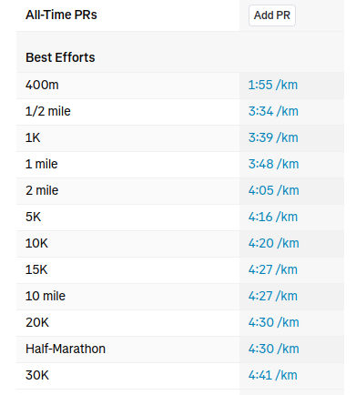
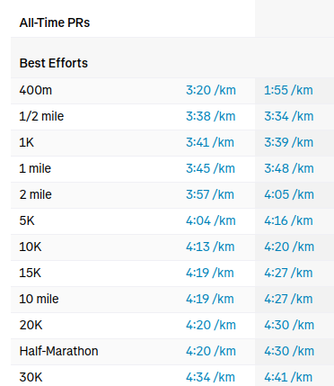
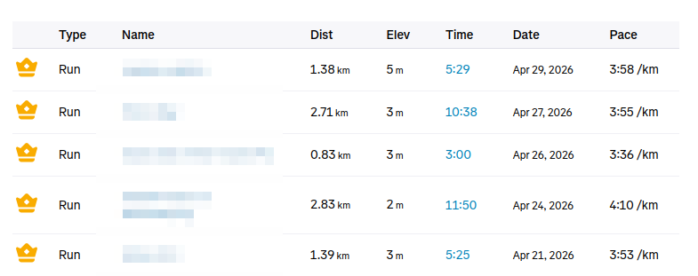
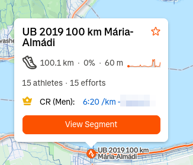

# Strava Pace Converter (Firefox Extension)

A lightweight Firefox extension that automatically converts absolute sport times into **min/km pace** across the Strava web interface. Mainly for running and cycling.

## 🏃 Why this exists?
For many athletes, seeing a "50:00" 10k PR is less useful than seeing "5:00/km". This extension does the mental math for you, injecting pace data directly into the UI where it's missing.

## Gallery
| Best effort pace | Compare pace |
| :---: | :---: |
|  |  |

| Leaderboards pace | Map pace |
| :---: | :---: |
|  |  |

## Features
- **Profile PRs:** Replaces total time with pace in the "All-Time PRs" table.
- **Map Segments:** When exploring the map, popup details are updated to show the pace of top efforts.
- **My Segments Table:** Adds a brand new "Pace" column to your personal segments list.

## Known Limitations
- **Map Segment Precision:** In the map view, Strava often displays distances with single-digit precision (e.g., showing "0.7km" even if the actual distance is 0.74km). This can cause the calculated pace to be slightly off, with the effect being more noticeable on shorter segments.

## Installation

### 1. Local Development / Private Use
1. Download this repository as a ZIP or clone it.
2. Open Firefox and type `about:debugging` in the address bar.
3. Click **"This Firefox"**.
4. Click **"Load Temporary Add-on..."**.
5. Select the `manifest.json` file in the project folder.

### 2. Install from extension store

https://addons.mozilla.org/en-US/firefox/addon/strava-pace-converter/

## License
This project is open source under the MIT License.

## Disclaimer
This extension is an independent project and is not affiliated with or endorsed by Strava, Inc.
